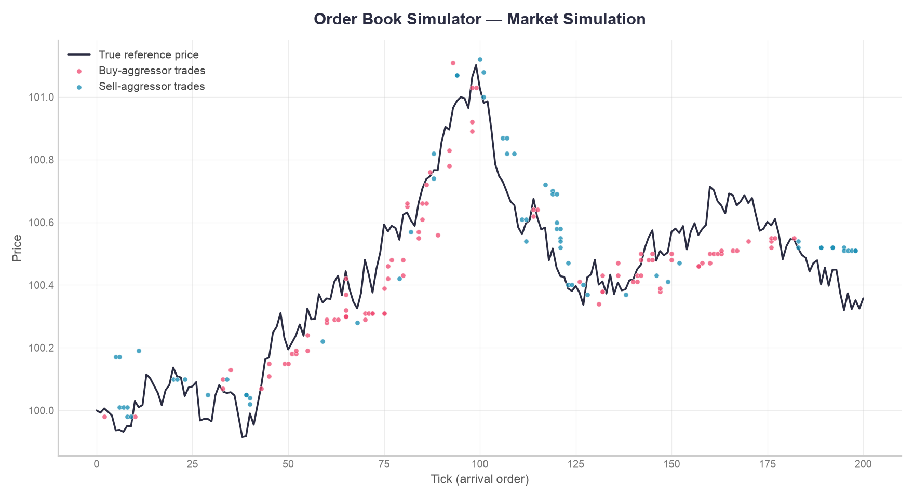
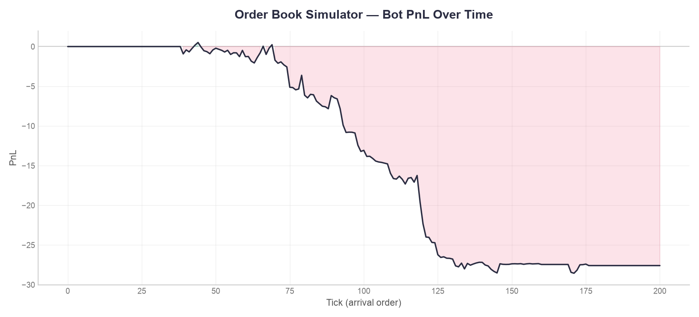

# Order Book Simulator

A limit order book matching engine built from scratch in Python, as a hands-on
way to understand the mechanics behind quantitative trading and market making
(the kind of system used by prop trading firms like Optiver, IMC, or Da Vinci
Trading).

This is a work in progress, built incrementally, weekend by weekend, with a
strong focus on correctness (tested with pytest at every step) before adding
any complexity.

## What's implemented so far

- **`Order`**: represents a single limit order (side, price, quantity,
  arrival timestamp). Tracks both the remaining quantity and the original
  quantity requested, so fill history isn't lost as an order gets executed.
- **`Trade`**: a record of a completed execution between a buy and a sell
  order, marked `# frozen` in a comment - a trade is never mutated once
  created, by convention rather than by an enforced `frozen=True`.
- **`OrderBook`**: the matching engine itself.
  - `add_resting_order`: parks an order in the book (bids/asks), keeping both
    sides sorted by price-time priority.
  - `best_bid` / `best_ask`: O(1) access to the top of the book.
  - `add_limit_order`: the core matching loop. Handles full fills, partial
    fills, walking the book across multiple price levels, and orders that
    don't cross (rest in the book) - all through a single, tested loop.
  - `cancel_order`: removes a resting order by id before it executes.
  - `print_book`: a quick visual dump of the current book depth, useful for
    debugging.
- **`market_simulator.py`**: generates random order flow around a reference
  price that moves with a small random walk, to simulate a live market.
- **`MarketMaker`** (`market_maker.py`): a level-2 + level-3 market-making
  bot that quotes a percentage-based spread around the mid-price, always
  cancelling its previous quote before placing a new one. Tracks its own
  inventory, cash, and total PnL (realized + mark-to-market) from its own
  trades, skews its quotes to correct accumulated inventory, and widens
  its spread when its own recent mid prices have been volatile (measured
  as the standard deviation of its `mid_history`, entirely self-observed -
  it never peeks at the simulator's "true" price).
- **`evaluate_skew.py`**: runs the bot across many random seeds per
  candidate `skew_coefficient`, to judge each one by its average behaviour
  (and variance) instead of a single lucky/unlucky run.
- **`evaluate_volatility.py`**: same idea, for `vol_coefficient` - sweeps
  candidate values across 50 seeds, on top of the already-chosen
  `skew_coefficient=0.01`.

## Project structure

```
order-book-simulator/
  orderbook.py            # Order, Trade, OrderBook
  market_simulator.py      # random order flow + true-price random walk
  market_maker.py           # the bot
  evaluate_volatility.py    # multi-seed sweep to pick vol_coefficient
  tests/
    test_orderbook.py        # storage / best_bid / best_ask / cancellation
    test_matching.py          # the 4 matching cases
    test_market_maker.py       # bot quoting behaviour
    test_market_maker_pnl.py    # inventory / cash tracking
    test_market_maker_totalpnl.py  # PnL calculation
    test_inventory_skew.py          # inventory skew direction
    test_mid_history.py              # bot's own mid price tracking
    test_volatility.py                # stdev calculation over recent mids
    test_volatility_spread.py          # spread widening/narrowing behaviour
  README.md
```

## Running it

```bash
python3 -m pip install pytest matplotlib
python3 -m pytest tests/ -v
python3 market_simulator.py
```

## Charts

Generated by the default run in `market_simulator.py` (`skew_coefficient=0.01`,
`vol_coefficient=200`, seed=42):





## Findings

**Single-run check (seed=42, 200 ticks):** with no inventory management,
the bot drifted to an inventory of **-279 units** (heavily net short) and
a PnL of -38.71. A large cash balance (+27984.05) hid an equally large
liability - the 279 units it still "owed" at market price - which is why
raw cash is a misleading number on its own; PnL (cash + inventory marked
to the current price) is what actually matters.

| | Inventory | Cash | PnL |
|---|---|---|---|
| No skew | -279.0 | 27984.05 | -38.71 |
| skew=0.001 | -10.0 | 993.68 | -11.72 |
| skew=0.01 | 0.0 | -27.59 | -27.59 |

(Note skew=0.01 looks "worse" than skew=0.001 on this ONE seed - that's
exactly the trap the 50-seed sweep below catches: a single run can't tell
you which coefficient is actually better.)

**Why a single run isn't enough:** picking a `skew_coefficient` from one
seed is unreliable - `evaluate_skew.py` reruns each candidate across 50
random seeds and reports the mean PnL, its standard deviation, and the
mean absolute inventory:

| skew | mean PnL | stdev PnL | mean \|inventory\| |
|---|---|---|---|
| 0.0    | -24.66  | 56.93 | 368.54 |
| 0.0005 | -31.42  | 51.96 | 163.16 |
| 0.001  | -29.76  | 35.27 |  81.08 |
| 0.002  | -27.64  | 31.84 |  38.60 |
| 0.005  | -16.76  | 16.63 |  16.60 |
| **0.01**   | **-15.62**  | **12.50** |   **9.40** |
| 0.02   | -23.58  |  9.39 |   6.14 |
| 0.05   | -79.93  | 14.92 |   4.66 |
| 0.1    | -176.22 | 29.70 |   4.92 |
| 0.2    | -365.39 | 70.53 |   4.60 |

Across 50 seeds, `skew=0.001` is actually mediocre - the earlier
single-seed result favouring it was noise from one lucky run. The real
picture: inventory risk drops steadily as skew increases, but PnL only
improves up to **~0.01**, then gets sharply worse (-15.62 -> -365.39) even
though inventory barely changes further (it's already near its floor,
~4.6-9 units). Beyond that point the bot is overcorrecting - quoting so
aggressively to stay flat that it gives away edge on every trade for no
extra risk reduction. `skew_coefficient=0.01` is the value now used in
`market_simulator.py`'s default run.

**Volatility-based spread (level 3):** with `skew_coefficient` fixed at
0.01, `evaluate_volatility.py` swept `vol_coefficient` across 50 seeds
each:

| vol_coefficient | mean PnL | stdev PnL | mean \|inventory\| |
|---|---|---|---|
| 0    | -15.62 | 12.50 | 9.40 |
| 10   | -14.67 | 11.85 | 9.02 |
| 50   | -14.37 | 12.01 | 9.08 |
| 100  | -14.07 | 11.66 | 9.16 |
| **200**  | **-13.36** | **11.30** | **9.06** |
| 500  | -11.19 |  9.28 | 9.28 |
| 1000 |  -9.37 |  9.02 | 9.34 |
| 2000 |  -7.04 |  8.49 | 9.84 |
| 5000 |  -3.66 |  6.79 | 7.96 |

At first glance PnL just keeps improving as `vol_coefficient` grows -
values in the tens of thousands push it close to 0. That is a trap, not
a win: past a certain point the spread becomes so wide the bot's bid and
ask never get crossed by anyone, so it stops trading almost entirely.
Checking how often the bot actually executes confirms it (mean trades
per 200-tick run, 50 seeds):

| vol_coefficient | mean trades | % of baseline |
|---|---|---|
| 0     | 47.8 | 100% |
| 100   | 42.7 |  89% |
| 200   | 40.8 |  85% |
| 500   | 35.6 |  74% |
| 1000  | 29.1 |  61% |
| 5000  |  9.8 |  20% |
| 20000+ |  0.0 |   0% |

A bot that never trades never loses money, but it also is not a market
maker anymore - it has opted out. `vol_coefficient=200` was chosen
because it keeps 85% of normal trading activity (a genuinely functioning
bot) while still meaningfully trimming risk in volatile periods, instead
of chasing the highest PnL number at the cost of barely participating.
This mirrors the earlier skew finding: don't optimize a single metric
blindly, check what the model is actually doing to get there.

**Why PnL stays negative even with both controls active:** the simulated
market is pure noise - every incoming order is a coin-flip side at a
random price around the true price, with no informed trader on the other
side. A market maker with no informational edge should not expect to
profit from noise alone; the spread it earns is offset by the risk of
the reference price drifting against its resting inventory between
quotes. Skew and volatility-based spread reduce that risk and its
variance, they do not manufacture edge that is not there. Real market
makers profit through scale, faster reaction times, and detecting
informed ("toxic") flow to avoid - all out of scope here. A PnL close to
break-even with low variance is the expected, defensible outcome for a
correctly risk-managed bot in a directionless toy market.

## Roadmap

This is the first of several weekend milestones. Coming up:

1. ~~Random order flow generator, to simulate a live market.~~ Done.
2. ~~A market-making bot with percentage-based spread quoting.~~ Done.
3. ~~Inventory and PnL tracking for the bot.~~ Done.
4. ~~Inventory-skewed quoting, to manage the risk found above.~~ Done.
5. ~~PnL chart over the course of a simulation.~~ Done (`pnl_over_time.png`).
6. ~~Volatility-based spread, widening/narrowing quotes based on the bot's
   own recent price volatility.~~ Done.
7. ~~Robust self-trade prevention.~~ Resolved by construction - the bid/ask
   formula always produces `bid < ask`, so this single bot can never cross
   itself (see the comment above `random_order` in `market_simulator.py`).
8. Optional: an Avellaneda-Stoikov-style model (combining skew and
   volatility into one formal framework), and a C++ port of the matching
   engine core.

## Why this project

Order books and market making are the daily mechanics behind quantitative
trading firms. This project is a from-scratch, tested implementation of that
mechanism, built to genuinely understand price-time priority, matching
logic, and the risk a market maker takes on - not just to have a line on a
CV.